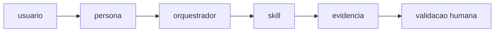

# IPIT - Ideathon Pedagogico com Inovacao Tecnologica

Projeto metodologico para apoiar docentes na organizacao de Ideathons com foco em problemas reais, prototipagem e evidencias de aprendizagem.

**Autoria metodologica:** Sandra Maria Pereira.

## O que e o IPIT

O IPIT e uma metodologia educacional em etapas para planejar, construir e apresentar solucoes tecnologicas com intencao pedagogica, avaliacao processual, inclusao e responsabilidade no uso de IA.

Mais detalhes: `METODOLOGIA (1).md`, [`docs/o-que-e-o-ipit.md`](./docs/o-que-e-o-ipit.md), [`docs/oito-etapas.md`](./docs/oito-etapas.md).

## O que e o Agente Conversacional IPIT

E um agente orientado por regras para apoiar docentes e equipes na execucao da metodologia, com foco em:
- roteamento por persona e contexto;
- orquestracao por skills;
- producao de evidencias;
- revisao humana obrigatoria em pontos criticos.

Referencia principal: [`AGENTS.md`](./AGENTS.md).

## Arquitetura e fluxo do agente

### Arquitetura (alto nivel)
- **Camada de entrada:** solicitacao do usuario + identificacao de persona.
- **Camada de orquestracao:** regras do agente e escolha de skill.
- **Camada de execucao:** skill selecionada e entrega de evidencias.
- **Camada de governanca:** validacao humana, seguranca, privacidade e politicas de IA.

### Fluxo (Mermaid)



## Personas

Exemplos cobertos nos testes: professora/professor, estudante, equipe pedagogica, gestao escolar, parceiro externo, apoio tecnico, mentor e familia.

## Catalogo de skills

- [`skills/iniciar-ideathon/SKILL.md`](./skills/iniciar-ideathon/SKILL.md)
- [`skills/orquestrar-ipit/SKILL.md`](./skills/orquestrar-ipit/SKILL.md)
- [`skills/planejar-arquitetura/SKILL.md`](./skills/planejar-arquitetura/SKILL.md)
- [`skills/acompanhar-desenvolvimento/SKILL.md`](./skills/acompanhar-desenvolvimento/SKILL.md)
- [`skills/preparar-pitch/SKILL.md`](./skills/preparar-pitch/SKILL.md)

Catalogo resumido: [`produtos/catalogo.md`](./produtos/catalogo.md)

## BNCC e equipe pedagogica

- Nao inventar codigos BNCC.
- Quando nao houver confirmacao documental: **"a validar pela equipe pedagogica"**.
- Validar sempre com curriculo local, PPP e equipe pedagogica.

Referencia: [`references/alinhamento-bncc.md`](./references/alinhamento-bncc.md).

## Instalacao e uso com GitHub Copilot

1. Abra este repositorio no VS Code.
2. Use o Copilot Chat com o contexto do repositorio.
3. Solicite uma skill de forma explicita e informe contexto da turma.
4. Revise a resposta com a equipe docente/pedagogica antes de execucao.

## Prompt de teste

```text
Quero iniciar um Ideathon com turma de 3o ano tecnico.
Use a skill iniciar-ideathon, identifique persona e faca ate tres perguntas diagnosticas.
Considere BNCC sem inventar codigos e registre "a validar pela equipe pedagogica" quando necessario.
```

## Validacao e testes

- Suite comportamental: `python3 -m pytest -q`
- CI: [`.github/workflows/pytest.yml`](./.github/workflows/pytest.yml)
- Testes incluem roteamento, persona, BNCC, seguranca, autoria, evidencias e proximo passo.

## Seguranca e politicas

- [`SECURITY.md`](./SECURITY.md)
- [`PRIVACY.md`](./PRIVACY.md)
- [`AI-USE-POLICY.md`](./AI-USE-POLICY.md)
- [`GOVERNANCE.md`](./GOVERNANCE.md)
- [`references/prompt-injection-policy.md`](./references/prompt-injection-policy.md)

## Limitacoes

- Projeto em evolucao, com foco atual em regras e testes comportamentais.
- Dependencia de revisao humana para decisoes pedagogicas e de dados.
- Nao substitui professor nem equipe pedagogica.

## Roadmap

- ampliar skills para etapas restantes da metodologia;
- aumentar testes de integracao entre fluxo, skills e evidencias;
- fortalecer observabilidade e criterios de qualidade pedagogica.

## Status

**Experimental**: estrutura e politicas em consolidacao.

## Como contribuir

Leia [`CONTRIBUTING.md`](./CONTRIBUTING.md) e use o template de PR em [`.github/pull_request_template.md`](./.github/pull_request_template.md).

## Licenciamento

Este repositorio usa a licenca ja definida em [`LICENSE`](./LICENSE).  
Nenhuma mudanca para licenca aberta ou comercial deve ocorrer sem decisao explicita da mantenedora.
