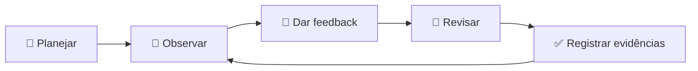

# 📊 Avaliação e acompanhamento no IPIT

A avaliação no IPIT é **processual, formativa e baseada em evidências**. O produto final importa, mas não substitui a análise do percurso.

## 🎯 O que observar

| Dimensão | Indicadores |
|---|---|
| 🔍 Problema | relevância, evidências e público definido |
| 💡 Solução | coerência entre problema e proposta |
| ⚙️ Técnica | viabilidade, arquitetura e testes |
| 🤝 Colaboração | participação, divisão de tarefas e revisão |
| 📝 Documentação | README, registros, decisões e limitações |
| 🤖 Ética digital | validação de IA, privacidade e segurança |
| 🎤 Comunicação | clareza, demonstração e argumentação |

## 🧭 Ciclo de acompanhamento

## 🧮 Rubrica sintética

- **4 — Evidência consistente:** entrega completa, justificada e validada.
- **3 — Evidência adequada:** entrega funcional, com pequenas lacunas.
- **2 — Evidência parcial:** entrega incompleta ou pouco fundamentada.
- **1 — Evidência insuficiente:** atividade sem comprovação verificável.

## 👩‍🏫 Papel do professor

O professor atua como mediador: formula perguntas, ajuda a delimitar o escopo, indica critérios de validação e acompanha a evolução sem assumir a construção da solução.

## 🧪 O erro como evidência de aprendizagem

Erros de programação, testes malsucedidos e mudanças de escopo devem ser registrados. O objetivo não é ocultar falhas, mas demonstrar como a equipe investigou, decidiu e evoluiu.

## 🗂️ Evidências recomendadas

- diário de bordo;
- issues e commits;
- wireframes;
- decisões técnicas;
- testes;
- retrospectiva;
- autoavaliação e avaliação entre pares;
- pitch e demonstração final.
