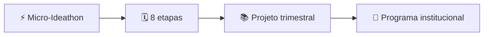

# 🏫 Formatos de aplicação do IPIT

O IPIT pode ser adaptado à duração, à infraestrutura e aos objetivos curriculares de cada instituição.

## ⚡ Micro-Ideathon

- **Duração:** um turno.
- **Escopo:** um problema e um protótipo de baixa fidelidade.
- **Recursos:** papel, canetas, um dispositivo por equipe e mediação docente.
- **Objetivo:** testar a metodologia e observar o engajamento.

## 🗓️ Jornada de oito etapas

- **Duração:** oito encontros ou dias.
- **Organização:** um entregável por etapa.
- **Resultado:** protótipo ou MVP demonstrável, com documentação.

## 📚 Projeto bimestral ou trimestral

Inclui preparação técnica, organização de ambientes, formação das equipes, estudos orientados, desenvolvimento, testes, banca e retrospectiva.

## 🏢 Programa institucional

Pode envolver várias turmas, professores, componentes curriculares, mentores e parceiros externos.

## ♿ Adaptações possíveis

- poucos computadores: rodízio de funções e prototipação em papel;
- baixa conectividade: materiais offline e sincronização posterior;
- Ensino Médio: protótipos conceituais e desafios interdisciplinares;
- curso técnico: arquitetura, código, testes e documentação;
- EJA: problemas relacionados ao trabalho e ao território;
- Educação Especial: acessibilidade, diferentes formas de participação e tecnologias assistivas.

> 🎯 Replicar não é copiar. É preservar os princípios e adaptar o percurso com intencionalidade pedagógica.
