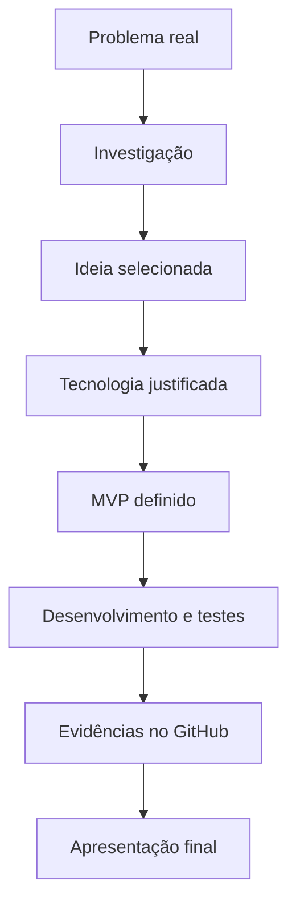
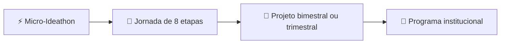

# 💡 O que é o IPIT?

O **IPIT — Ideathon Pedagógico de Inovação Tecnológica** é uma metodologia educacional criada para orientar professores, escolas e cursos técnicos na transformação de problemas reais em projetos tecnológicos desenvolvidos por estudantes.

A proposta combina **aprendizagem baseada em projetos**, **Design Thinking**, **cultura maker**, **metodologias ágeis**, **documentação no GitHub**, **uso responsável de Inteligência Artificial** e desenvolvimento de **Produtos Mínimos Viáveis (MVPs)**.

Mais do que um evento isolado, o IPIT organiza um percurso formativo no qual os estudantes investigam necessidades da escola ou da comunidade, trabalham em equipe, tomam decisões, selecionam tecnologias, constroem protótipos, testam soluções, registram evidências e apresentam seus resultados.

> 🎯 **Princípio central:** cada etapa do IPIT termina com um entregável verificável. O avanço da equipe depende das evidências produzidas, e não apenas da participação nas atividades.

---

## 🧭 Visão geral da metodologia

O percurso pode ser realizado em **oito dias**, **oito encontros** ou distribuído ao longo de um **bimestre ou trimestre**, conforme os objetivos curriculares, o perfil dos estudantes e as condições da instituição.

---

## 🎓 Por que o IPIT foi criado?

O IPIT nasceu da necessidade de aproximar o currículo escolar das práticas contemporâneas de inovação e desenvolvimento tecnológico.

Em cursos técnicos e projetos interdisciplinares, conteúdos como programação, banco de dados, design, redes, hardware, documentação e gestão de projetos costumam ser ensinados de forma fragmentada. A metodologia propõe integrar esses conhecimentos em torno de desafios autênticos, permitindo que os estudantes compreendam como diferentes competências se articulam na construção de uma solução.

A proposta também busca superar uma visão limitada de educação tecnológica baseada apenas no uso de ferramentas. No IPIT, o estudante deixa de ser somente consumidor de tecnologia e passa a atuar como:

- 🔍 investigador de problemas;
- 💡 autor de soluções;
- 🤝 integrante de uma equipe multidisciplinar;
- 🧪 desenvolvedor de protótipos e MVPs;
- ⚖️ responsável por decisões técnicas e éticas;
- 🎤 comunicador do processo e dos resultados.

---

## 👥 Para quem é o IPIT?

A metodologia pode ser aplicada em diferentes contextos educacionais, com adaptações de duração, profundidade técnica e infraestrutura.

### 🎯 Públicos prioritários

- 👩‍🏫 professores da Educação Profissional e Tecnológica;
- 🏫 escolas de Ensino Médio;
- 💻 cursos técnicos;
- ⏱️ programas de tempo integral;
- 📚 Educação de Jovens e Adultos;
- 🧩 projetos interdisciplinares;
- 🛠️ laboratórios de inovação e cultura maker;
- 🎓 programas de formação de professores;
- 🚀 iniciativas de empreendedorismo e tecnologia educacional.

O IPIT pode ser realizado com programação e desenvolvimento de software, mas também admite protótipos de baixa fidelidade, atividades desplugadas, projetos com poucos computadores e soluções baseadas em diferentes áreas tecnológicas.

---

## ⚙️ Como a metodologia funciona?

O percurso metodológico é organizado em **oito etapas integradas**:

1. 🔍 **Descoberta** — compreender o problema, o contexto e os usuários.
2. 💡 **Ideação** — gerar alternativas e selecionar uma proposta de valor.
3. 🧩 **Solução** — desenhar o fluxo, a jornada e a experiência de uso.
4. ⚙️ **Tecnologia** — selecionar ferramentas, integrações e recursos técnicos.
5. 🚀 **MVP** — definir o menor produto capaz de demonstrar valor.
6. 🏗️ **Arquitetura** — planejar componentes, dados, tarefas e organização do repositório.
7. 💻 **Desenvolvimento** — implementar, integrar, testar e documentar o protótipo.
8. 🎤 **Pitch e finalização** — demonstrar a solução, apresentar evidências e registrar aprendizados.

### 📦 Lógica de progressão

---

## ✨ O que diferencia o IPIT?

### 🎯 1. Problemas autênticos

Os projetos partem de necessidades reais da escola, do território ou da comunidade. A tecnologia é escolhida depois da compreensão do problema, e não o contrário.

### 📚 2. Integração curricular

A metodologia permite articular diferentes componentes e competências em um mesmo percurso, reduzindo a fragmentação entre teoria e prática.

### 👩‍🎓 3. Protagonismo estudantil

Os estudantes investigam, decidem, criam, testam, documentam e apresentam. O professor atua como mediador, orientador e responsável pela intencionalidade pedagógica.

### ✅ 4. Entregáveis verificáveis

Cada etapa produz documentos, protótipos, decisões, registros ou evidências que tornam o processo de aprendizagem visível e avaliável.

### 🐙 5. Documentação no GitHub

O repositório funciona como portfólio do projeto e memória do percurso. Nele, a equipe registra problemas, decisões, arquitetura, código, testes, limitações e próximos passos.

### 🤖 6. Uso crítico de Inteligência Artificial

Ferramentas como GPT, Gemini e GitHub Copilot podem apoiar pesquisa, prototipagem, programação e documentação. Seu uso deve ser acompanhado de validação humana, testes, registro das decisões e preservação da autoria estudantil.

### 🔧 7. Flexibilidade tecnológica

O IPIT não depende de uma plataforma específica. Pode ser aplicado com desenvolvimento web, aplicativos móveis, banco de dados, Inteligência Artificial, Internet das Coisas, robótica, ciência de dados, computação em nuvem, Web3 ou tecnologias assistivas.

### 📊 8. Avaliação processual e formativa

A avaliação considera não apenas o produto final, mas também a qualidade da investigação, a coerência das decisões, a colaboração, a documentação, os testes, a ética e a capacidade de comunicação.

---

## 🗂️ Formatos de aplicação

### ⚡ Micro-Ideathon

Realizado em um turno, com um problema, uma equipe ou turma e um protótipo de baixa fidelidade. É indicado para apresentação inicial da metodologia ou realização de um projeto-piloto.

### 🧭 Jornada de oito etapas

Executada em oito encontros ou dias de trabalho, com um entregável ao final de cada etapa.

### 📅 Projeto bimestral ou trimestral

Inclui formação técnica, preparação dos ambientes, estudos orientados, desenvolvimento do projeto e culminância.

### 🏫 Programa institucional

Pode envolver diferentes turmas, componentes curriculares, professores, parceiros, mentores e uma banca externa de avaliação.

---

## 🧠 Competências desenvolvidas

A aplicação do IPIT pode contribuir para o desenvolvimento de:

- 🔍 investigação e resolução de problemas;
- 💭 pensamento crítico e criativo;
- 💻 cultura digital;
- 🗣️ comunicação oral e escrita;
- 🤝 trabalho em equipe;
- 📋 planejamento e gestão de tarefas;
- 🧭 autonomia e tomada de decisão;
- 📝 documentação técnica;
- 🛠️ prototipação e desenvolvimento de soluções;
- 🛡️ uso ético, seguro e responsável das tecnologias;
- 🎤 argumentação e apresentação de projetos.

---

## 🏫 Experiência de origem

A metodologia foi sistematizada a partir de uma prática realizada com **14 estudantes do 3º ano do Curso Técnico em Informática da Escola Estadual Geraldo Jardim Linhares**, em Belo Horizonte.

O projeto foi desenvolvido ao longo de um trimestre letivo e integrou preparação técnica, organização de equipes, pesquisa, ideação, prototipação, desenvolvimento, documentação no GitHub, testes e apresentação a uma banca.

A experiência resultou em oito soluções tecnológicas voltadas a desafios educacionais, sociais, culturais e comunitários. Entre os resultados observados estiveram:

- 📈 maior participação nas aulas;
- 🧭 ampliação da autonomia;
- 🤝 fortalecimento da colaboração;
- 🔗 integração entre componentes curriculares;
- 🎤 melhoria da comunicação;
- 🐙 desenvolvimento de competências relacionadas ao GitHub;
- 📝 avanço na documentação técnica;
- 🔄 aproximação com metodologias ágeis.

> 📌 **Nota de rigor:** esses resultados correspondem a uma experiência situada e não devem ser interpretados como garantia automática de desempenho em outros contextos. Cada aplicação precisa ser planejada, acompanhada e avaliada conforme sua realidade.

---

## 🚫 O que o IPIT não é

O IPIT não é:

- 🏆 uma competição sem intencionalidade pedagógica;
- 🧰 um treinamento restrito ao uso de ferramentas;
- ⛓️ uma metodologia dependente de Web3 ou Blockchain;
- 🤖 uma proposta em que a Inteligência Artificial substitui o trabalho dos estudantes;
- 📏 um modelo rígido que deve ser reproduzido sem adaptações;
- 🎁 uma atividade centrada apenas no produto final.

Replicar o IPIT significa preservar seus princípios, adaptando duração, tecnologias, recursos e nível de complexidade às condições locais.

---

## 🧩 Princípios para implementação

Para manter a coerência metodológica, recomenda-se:

- 🎯 partir de um desafio autêntico;
- 📚 relacionar as atividades aos objetivos curriculares;
- 👩‍🎓 garantir autoria e protagonismo estudantil;
- ✅ organizar entregáveis para cada etapa;
- 📊 utilizar avaliação processual e formativa;
- 📝 documentar decisões, testes e aprendizados;
- 🛡️ adotar critérios de segurança, privacidade e acessibilidade;
- ⚙️ escolher tecnologias com base nas necessidades do projeto;
- 🌍 relacionar as soluções à escola, ao território ou à comunidade;
- 🔄 reservar momentos para reflexão, feedback e continuidade.

---

## 👩‍🏫 Autoria

O IPIT foi criado e sistematizado por **Sandra Maria Pereira**, bacharel em Ciência da Informação, mestre em Informática pela PUC Minas e professora do Curso Técnico em Informática.

A metodologia reúne experiência docente, integração curricular, aprendizagem baseada em projetos, inovação tecnológica e práticas de documentação e desenvolvimento colaborativo.

---

## 🚀 Próximos passos

- 📘 Consulte a [metodologia completa](metodologia.md).
- 🧭 Conheça as [oito etapas do IPIT](metodologia.md#como-a-metodologia-funciona).
- 🎁 Veja os materiais disponíveis em [`kit-gratuito/`](../kit-gratuito/README.md).
- 🏫 Consulte o estudo de caso da experiência de origem.
