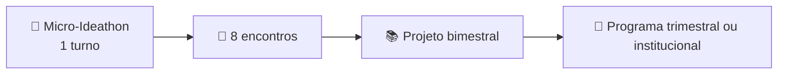

# 🚀 As Oito Etapas do IPIT

> **IPIT — Ideathon Pedagógico de Inovação Tecnológica**  
> **Autora:** Sandra Maria Pereira

O IPIT organiza a aprendizagem em **oito etapas progressivas**, que conduzem os estudantes da identificação de um problema real até a apresentação de uma solução demonstrável.

A metodologia combina investigação, criatividade, planejamento técnico, desenvolvimento, documentação no GitHub, uso responsável de Inteligência Artificial e avaliação por evidências.

> 🎯 **Princípio central:** cada etapa termina com um entregável verificável. O avanço da equipe depende do que foi investigado, decidido, construído, testado e documentado.

---

## 🧭 Visão geral do percurso


| Etapa | Foco principal | Entregável esperado |
|---|---|---|
| 🔎 1. Descoberta | Compreender o problema e os usuários | Problema definido com evidências |
| 💡 2. Ideação | Gerar e selecionar alternativas | Proposta de valor priorizada |
| 🧩 3. Solução | Desenhar a experiência de uso | Fluxo do usuário e protótipo inicial |
| ⚙️ 4. Tecnologia | Escolher recursos técnicos | Stack e justificativas documentadas |
| 🚀 5. MVP | Delimitar o mínimo viável | Escopo priorizado e critérios de sucesso |
| 🏗️ 6. Arquitetura | Planejar a construção | Arquitetura, backlog e divisão de tarefas |
| 💻 7. Desenvolvimento | Implementar e testar | MVP executável e documentado |
| 🎤 8. Pitch e finalização | Demonstrar e comunicar | Pitch, README final e retrospectiva |

---

# 🔎 Etapa 01 — Descoberta

## Finalidade

Compreender o contexto antes de propor qualquer tecnologia.

Nesta etapa, a equipe investiga uma necessidade real da escola, do território ou da comunidade. O objetivo é evitar soluções baseadas apenas em suposições.

## Atividades sugeridas

1. Apresentar o desafio e formar as equipes.
2. Identificar usuários e pessoas afetadas.
3. Levantar dores, necessidades e restrições.
4. Realizar observações, entrevistas ou consultas a dados.
5. Formular o problema principal em uma frase clara.
6. Registrar hipóteses, evidências e dúvidas.

## Perguntas orientadoras

- 👥 Quem vivencia o problema?
- 📍 Em qual contexto ele ocorre?
- ⚠️ Qual consequência concreta ele produz?
- 🔍 Que evidências demonstram sua relevância?
- 🎯 O que deveria melhorar ao final do projeto?

## Entregável

Arquivo sugerido: `docs/01-descoberta.md`

Deve conter:

- problema priorizado;
- público envolvido;
- contexto;
- evidências encontradas;
- hipóteses iniciais;
- critérios que indicam melhoria.

## Critério de conclusão

Uma pessoa externa deve conseguir compreender **quem possui o problema, qual é a necessidade e por que ela importa**.

---

# 💡 Etapa 02 — Ideação

## Finalidade

Gerar alternativas e selecionar uma direção de solução coerente com o problema investigado.

## Atividades sugeridas

1. Realizar brainstorming sem julgamento inicial.
2. Agrupar ideias semelhantes.
3. Comparar impacto, viabilidade e relevância.
4. Selecionar a hipótese mais promissora.
5. Definir público-alvo ou persona.
6. Elaborar a proposta de valor.

## Ferramentas possíveis

- mapa mental;
- mural de ideias;
- matriz impacto × esforço;
- mapa de empatia;
- proposta de valor;
- votação orientada por critérios.

## Entregável

Arquivo sugerido: `docs/02-ideacao.md`

Deve conter:

- lista das alternativas;
- critérios utilizados;
- matriz de priorização;
- ideia selecionada;
- proposta de valor;
- perfil de usuário.

## Critério de conclusão

A solução escolhida deve responder diretamente ao problema definido na Etapa 01.

---

# 🧩 Etapa 03 — Solução

## Finalidade

Transformar a ideia em uma experiência de uso compreensível e testável.

## Atividades sugeridas

1. Descrever a jornada do usuário.
2. Desenhar o fluxo principal.
3. Definir entradas, ações e resultados.
4. Criar esboços de telas ou wireframes.
5. Identificar exceções e riscos.
6. Validar o fluxo com colegas ou usuários potenciais.

## Entregáveis

- `docs/03-solucao.md`;
- fluxo do usuário;
- wireframes ou protótipo de baixa fidelidade;
- lista inicial de funcionalidades;
- registro dos feedbacks recebidos.

## Critério de conclusão

O fluxo deve mostrar como o usuário parte de uma necessidade e alcança um resultado útil por meio da solução.

---

# ⚙️ Etapa 04 — Tecnologia

## Finalidade

Selecionar tecnologias coerentes com os requisitos do projeto, evitando complexidade desnecessária.

## Atividades sugeridas

1. Identificar requisitos funcionais e não funcionais.
2. Escolher frontend, backend e banco de dados.
3. Avaliar APIs, autenticação e serviços externos.
4. Identificar usos responsáveis de IA e automação.
5. Analisar riscos de segurança e privacidade.
6. Decidir se Web3 ou Blockchain são realmente necessárias.

## Perguntas para escolha tecnológica

- 🧰 Qual tecnologia resolve melhor cada requisito?
- 💰 Há custos de uso ou hospedagem?
- 🛡️ Quais dados serão tratados?
- 🔐 Como proteger credenciais e informações pessoais?
- 🌐 Um banco de dados convencional é suficiente?
- ⛓️ Web3 produz valor real ou apenas aumenta a complexidade?

## Entregável

Arquivo sugerido: `docs/04-tecnologia.md`

Deve conter:

- stack escolhida;
- justificativas;
- integrações previstas;
- requisitos de segurança;
- riscos e limitações;
- decisão fundamentada sobre Web3, quando aplicável.

## Critério de conclusão

Cada tecnologia deve estar relacionada a uma necessidade concreta do projeto.

---

# 🚀 Etapa 05 — MVP

## Finalidade

Definir o menor produto capaz de demonstrar valor ao usuário.

## Atividades sugeridas

1. Separar funcionalidades essenciais das desejáveis.
2. Identificar o caminho crítico da demonstração.
3. Definir critérios de sucesso.
4. Estabelecer limites de tempo e escopo.
5. Registrar o que ficará fora da primeira versão.
6. Transformar funcionalidades em tarefas.

## Quadro de priorização

| Categoria | Significado |
|---|---|
| ✅ Essencial | Sem isso, o valor principal não pode ser demonstrado |
| 🟡 Importante | Melhora a solução, mas pode esperar |
| 🔵 Futuro | Pode entrar em versões posteriores |
| ❌ Fora do escopo | Não será desenvolvido nesta edição |

## Entregável

Arquivo sugerido: `docs/05-mvp.md`

Deve conter:

- definição do MVP;
- funcionalidades essenciais;
- funcionalidades futuras;
- itens fora do escopo;
- critérios de sucesso;
- roteiro da demonstração.

## Critério de conclusão

O MVP precisa ser realizável no tempo disponível e demonstrar uma proposta de valor completa, mesmo que limitada.

---

# 🏗️ Etapa 06 — Arquitetura

## Finalidade

Planejar a construção antes do desenvolvimento intensivo.

## Atividades sugeridas

1. Desenhar os componentes do sistema.
2. Definir fluxos e modelos de dados.
3. Estruturar as pastas do repositório.
4. Criar issues e backlog.
5. Distribuir tarefas e responsabilidades.
6. Definir convenções de branches, commits e revisão.

## Exemplo de estrutura

```text
.
├── README.md
├── docs/
├── src/
├── tests/
├── assets/
└── .github/
    ├── ISSUE_TEMPLATE/
    └── pull_request_template.md
```

## Entregáveis

- `docs/06-arquitetura.md`;
- diagrama de arquitetura;
- modelo de dados;
- backlog inicial;
- responsáveis por tarefa;
- estrutura do repositório.

## Critério de conclusão

A equipe deve saber **o que construir, em qual ordem, onde registrar e quem é responsável**.

---

# 💻 Etapa 07 — Desenvolvimento e Testes

## Finalidade

Implementar, integrar, testar e documentar o MVP.

## Atividades sugeridas

1. Desenvolver em incrementos pequenos.
2. Integrar frontend, backend, banco de dados e serviços.
3. Testar o fluxo principal.
4. Registrar erros e decisões nas issues.
5. Atualizar a documentação.
6. Identificar limitações conhecidas.
7. Preparar uma demonstração honesta.

## Regras recomendadas no GitHub

- 📌 uma tarefa relevante por issue;
- 💬 commits frequentes e descritivos;
- 🌿 branches para alterações de maior risco;
- 👀 revisão antes da integração;
- 📖 README atualizado;
- 🔐 nenhuma senha, chave ou dado pessoal no repositório;
- 🧪 evidências de teste registradas.

## Entregável

MVP executável acompanhado de:

- código-fonte;
- instruções de instalação e execução;
- evidências de teste;
- lista de limitações;
- backlog de correções.

## Critério de conclusão

O fluxo principal deve funcionar de ponta a ponta ou possuir uma demonstração transparente das partes simuladas.

---

# 🎤 Etapa 08 — Pitch e Finalização

## Finalidade

Demonstrar a solução, comunicar o processo e registrar os aprendizados.

## Estrutura sugerida do pitch

1. 🔎 Problema e público.
2. 📊 Evidência da necessidade.
3. 💡 Solução proposta.
4. 🚀 Demonstração do MVP.
5. 🏗️ Arquitetura e tecnologias.
6. 🤖 Uso de IA, quando aplicável.
7. ⚠️ Limitações.
8. 🛣️ Próximos passos.

## Entregáveis

- pitch de 3 a 5 minutos;
- demonstração do MVP;
- README final;
- registro de uso de IA;
- retrospectiva da equipe;
- backlog de continuidade.

## Critério de conclusão

A apresentação deve demonstrar problema, solução, evidências do processo, produto desenvolvido, limitações e aprendizados.

---

# 📊 Avaliação por evidências

| Dimensão | Evidências esperadas |
|---|---|
| 🔎 Problema e usuário | pesquisa, observações e definição do problema |
| 💡 Proposta de valor | ideia escolhida e justificativa |
| 🧩 Experiência | fluxo, wireframes e validação |
| ⚙️ Decisão técnica | stack, segurança, privacidade e arquitetura |
| 💻 Execução | código, commits, issues e integração |
| 🧪 Qualidade | testes, documentação e tratamento de erros |
| 🤝 Colaboração | divisão de tarefas, revisão e comunicação |
| 🎤 Comunicação | demonstração, pitch e reflexão final |

## Rubrica sintética

- **4 — Evidência consistente:** entrega completa, justificada e validada.
- **3 — Evidência adequada:** entrega funcional, com pequenas lacunas.
- **2 — Evidência parcial:** entrega incompleta ou pouco fundamentada.
- **1 — Evidência insuficiente:** atividade sem comprovação verificável.

---

# 🤖 Uso responsável de Inteligência Artificial

Ferramentas como GPT, Gemini e GitHub Copilot podem apoiar pesquisa, ideação, prototipagem, programação e documentação.

A equipe continua responsável por:

- revisar o conteúdo gerado;
- compreender o código utilizado;
- testar as respostas;
- registrar prompts relevantes;
- corrigir erros e vieses;
- não inserir dados pessoais, senhas ou credenciais;
- preservar a autoria humana;
- declarar como a IA foi utilizada.

> 🧠 **A IA é apoio cognitivo, não substituta da investigação, da autoria ou da decisão da equipe.**

---

# 🛡️ Segurança, privacidade e acessibilidade

Durante todas as etapas, recomenda-se:

- coletar apenas dados necessários;
- evitar nomes, notas e informações pessoais de estudantes;
- nunca publicar senhas, chaves privadas ou tokens de API;
- utilizar ambientes de teste;
- verificar acessibilidade das interfaces;
- registrar riscos e limitações;
- solicitar autorização para uso de imagens;
- não armazenar dados sensíveis em Blockchain.

---

# 🔄 Adaptação da metodologia

As oito etapas podem ser aplicadas em diferentes formatos:



A metodologia pode utilizar:

- desenvolvimento web;
- aplicativos móveis;
- Inteligência Artificial;
- banco de dados;
- Internet das Coisas;
- robótica;
- ciência de dados;
- computação em nuvem;
- Web3;
- tecnologias assistivas;
- protótipos em papel.

> 🔁 **Replicar não significa copiar. Significa preservar os princípios e adaptar o percurso às condições locais.**

---

# ✅ Resultado esperado

Ao final das oito etapas, cada equipe deverá possuir um repositório que conte a história completa do projeto:

- problema investigado;
- público definido;
- alternativas consideradas;
- solução desenhada;
- tecnologias justificadas;
- MVP delimitado;
- arquitetura planejada;
- protótipo desenvolvido;
- testes realizados;
- uso de IA documentado;
- pitch apresentado;
- aprendizados registrados.

---

## ✍️ Autoria

**Sandra Maria Pereira**  
Bacharel em Ciência da Informação  
Mestre em Informática pela PUC Minas  
Professora do Curso Técnico em Informática

Este material integra o **IPIT — Ideathon Pedagógico de Inovação Tecnológica**.
