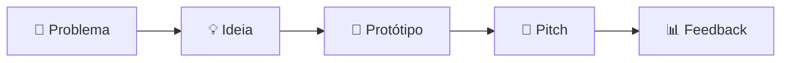

# 🚀 Guia do Micro-Ideathon

**Autora:** Sandra Maria Pereira  
**Metodologia:** IPIT — Ideathon Pedagógico de Inovação Tecnológica

> 🎯 **Finalidade:** experimentar o IPIT em escala reduzida, em um turno, com um desafio autêntico e um protótipo de baixa fidelidade.

## ⏱️ Duração sugerida

De 3 a 4 horas, com possibilidade de adaptação.

## 👥 Organização

- equipes de 3 a 5 estudantes;
- um desafio comum ou desafios diferentes por grupo;
- protótipo em papel, slides, ferramenta de wireframe ou recurso simples;
- apresentação final de 3 minutos por equipe.

## 🧭 Roteiro do encontro

| Momento | Duração sugerida | Produto |
|---|---:|---|
| 1. Abertura e desafio | 20 min | Compreensão da proposta |
| 2. Descoberta | 35 min | Problema e público definidos |
| 3. Ideação | 35 min | Ideia priorizada |
| 4. Proposta de valor | 25 min | Benefício principal |
| 5. Prototipação | 60 min | Protótipo de baixa fidelidade |
| 6. Preparação do pitch | 25 min | Apresentação organizada |
| 7. Pitch e feedback | 40 min | Demonstração e devolutiva |

## 🔎 Etapa 1 — Descoberta

Perguntas orientadoras:

- Quem enfrenta o problema?
- Em que situação ele ocorre?
- Qual consequência ele gera?
- Que evidência temos de que o problema é relevante?

**Entregável:** uma frase clara de definição do problema.

## 💡 Etapa 2 — Ideação

1. Gere o maior número possível de ideias.
2. Agrupe ideias semelhantes.
3. Avalie impacto e viabilidade.
4. Escolha uma proposta.

**Entregável:** ideia escolhida e justificativa.

## 🧩 Etapa 3 — Proposta e protótipo

O protótipo deve mostrar:

- quem usa;
- como começa;
- quais ações realiza;
- que resultado recebe.

Pode ser produzido com:

- papel e canetas;
- cartões e notas adesivas;
- slides;
- Canva, Figma ou ferramenta equivalente;
- encenação do fluxo.

## 🎤 Etapa 4 — Pitch

Cada equipe deve responder:

1. Qual problema investigamos?
2. Quem é afetado?
3. Qual solução propomos?
4. Como o protótipo funciona?
5. Que impacto esperamos?
6. O que faríamos em uma próxima versão?

## 📊 Avaliação rápida

Use escala de 1 a 4 para avaliar:

- clareza do problema;
- coerência da solução;
- participação da equipe;
- qualidade do protótipo;
- comunicação no pitch.

## 🧰 Materiais mínimos

- [ ] folhas A4 ou cartolina;
- [ ] canetas e marcadores;
- [ ] notas adesivas;
- [ ] cronômetro;
- [ ] projetor, quando disponível;
- [ ] checklist, canvas e rubrica deste kit.

## 📴 Adaptação sem internet

O Micro-Ideathon pode ser realizado integralmente offline. Pesquisa, ideação, prototipação e pitch não dependem de programação ou acesso a plataformas digitais.

## ♿ Inclusão e acessibilidade

- distribua papéis de acordo com as possibilidades de participação;
- ofereça materiais em formatos acessíveis;
- permita respostas escritas, visuais ou orais;
- evite que apenas estudantes com maior domínio técnico assumam o projeto;
- considere tempo adicional e mediação específica quando necessário.

## 🔄 Fechamento

Ao final, peça que cada equipe registre:

- uma aprendizagem;
- uma dificuldade;
- uma melhoria para a próxima aplicação;
- um possível próximo passo para o projeto.

---

**Autora:** Sandra Maria Pereira  
**IPIT — Ideathon Pedagógico de Inovação Tecnológica**