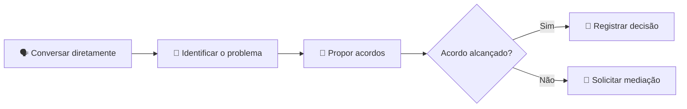

# 🤝 Acordo de Equipe — IPIT

> 🎯 **Objetivo:** estabelecer regras claras de colaboração, comunicação, responsabilidade, autoria e tomada de decisão antes do início do projeto.

Este acordo deve ser construído coletivamente. Todos os integrantes precisam compreender e aceitar os compromissos registrados.

---

## 🧩 Identificação da equipe

- **Nome da equipe:**
- **Nome do projeto:**
- **Turma / curso:**
- **Professor(a) orientador(a):**
- **Período de realização:**
- **Link do repositório no GitHub:**

### 👥 Integrantes

| Nome | Usuário no GitHub | Função principal | Função de apoio |
|---|---|---|---|
|  |  |  |  |
|  |  |  |  |
|  |  |  |  |
|  |  |  |  |

> 🔄 As funções podem ser revistas durante o projeto, desde que a mudança seja comunicada e registrada.

---

## 🌟 Propósito da equipe

### Qual problema queremos ajudar a resolver?

### Para quem estamos criando esta solução?

### Qual impacto esperamos gerar?

### Frase de propósito da equipe

> Nós nos comprometemos a ________________________________________________.

---

# 📌 Compromissos coletivos

## 1. 🤝 Participação e responsabilidade

A equipe concorda em:

- [ ] participar dos encontros e atividades planejadas;
- [ ] avisar com antecedência quando não puder participar;
- [ ] cumprir as tarefas assumidas ou comunicar dificuldades;
- [ ] não deixar atividades acumuladas sem informar o grupo;
- [ ] apoiar colegas quando houver bloqueios;
- [ ] registrar o andamento das tarefas no GitHub ou no instrumento definido.

### Regras específicas da equipe

-
-
-

---

## 2. 💬 Comunicação

### Canal principal

- [ ] Grupo de mensagens
- [ ] GitHub Discussions
- [ ] Issues do GitHub
- [ ] E-mail
- [ ] Plataforma institucional
- [ ] Outro:

### Prazo esperado para respostas

> Exemplo: responder mensagens importantes em até 24 horas nos dias letivos.

### Como faremos perguntas e pedidos de ajuda?

### Como registraremos decisões importantes?

- [ ] Diário de bordo
- [ ] Issues do GitHub
- [ ] Ata de reunião
- [ ] README do projeto
- [ ] Outro:

---

## 3. 🧭 Organização e divisão de tarefas

A distribuição inicial será feita considerando interesses, conhecimentos e necessidades de aprendizagem.

| Área | Responsável principal | Apoio | Entregável esperado |
|---|---|---|---|
| 🔍 Pesquisa |  |  |  |
| 🎨 Design / UX |  |  |  |
| 💻 Desenvolvimento |  |  |  |
| 🗄️ Banco de dados |  |  |  |
| 📝 Documentação |  |  |  |
| 🧪 Testes |  |  |  |
| 🎤 Comunicação / pitch |  |  |  |
| 🐙 GitHub / organização |  |  |  |

### Critérios para redistribuir tarefas

-
-
-

> ⚖️ Dividir tarefas não significa isolar conhecimentos. Todos devem compreender o problema, a solução e o funcionamento geral do projeto.

---

## 4. ⏱️ Prazos e acompanhamento

### Frequência de acompanhamento

- [ ] A cada encontro
- [ ] Diariamente durante a sprint
- [ ] Duas vezes por semana
- [ ] Semanalmente
- [ ] Outro:

### Instrumento de acompanhamento

- [ ] GitHub Projects
- [ ] Issues
- [ ] Quadro Kanban
- [ ] Planilha
- [ ] Diário de bordo
- [ ] Outro:

### Regra para tarefas atrasadas

Quando uma tarefa não puder ser concluída no prazo, o responsável deverá:

1. comunicar a equipe;
2. explicar o bloqueio;
3. atualizar o status da tarefa;
4. solicitar apoio ou renegociar o prazo;
5. registrar a decisão.

### Outras regras de prazo

-
-

---

## 5. 🧠 Tomada de decisão

### Como decidiremos?

- [ ] Consenso
- [ ] Votação simples
- [ ] Responsável técnico decide após ouvir a equipe
- [ ] Professor(a) media quando necessário
- [ ] Combinação dos critérios acima

### Decisões que exigem participação de toda a equipe

- mudança do problema principal;
- alteração relevante do público-alvo;
- escolha ou troca da tecnologia central;
- mudança do escopo do MVP;
- publicação de dados, imagens ou materiais;
- envio da versão final;
- outras:

### Como registraremos as decisões?

---

## 6. 🧩 Conflitos e convivência

A equipe se compromete a:

- [ ] ouvir antes de responder;
- [ ] criticar ideias sem atacar pessoas;
- [ ] não interromper ou ridicularizar colegas;
- [ ] respeitar ritmos, limites e necessidades diferentes;
- [ ] procurar soluções baseadas em fatos e critérios;
- [ ] solicitar mediação quando o conflito não puder ser resolvido internamente.

### Procedimento para resolver conflitos

### Quem poderá atuar como mediador(a)?

- Professor(a):
- Coordenador(a):
- Representante da equipe:
- Outro:

---

## 7. ✍️ Autoria, créditos e propriedade intelectual

A equipe concorda que:

- [ ] todos os participantes serão creditados de forma justa;
- [ ] contribuições individuais relevantes serão registradas;
- [ ] códigos, imagens, textos e dados externos terão suas fontes indicadas;
- [ ] nenhum integrante apresentará o trabalho coletivo como produção exclusivamente individual;
- [ ] o uso de materiais de terceiros respeitará licenças e autorizações;
- [ ] a publicação de imagens e dados pessoais dependerá de autorização adequada.

### Forma de apresentação dos créditos

### Licença prevista para o repositório, quando aplicável

- [ ] A definir com orientação do professor
- [ ] Licença de software:
- [ ] Licença de conteúdo:
- [ ] Repositório apenas demonstrativo

---

## 8. 🤖 Uso de Inteligência Artificial

Ferramentas como GPT, Gemini e GitHub Copilot podem ser usadas como apoio, desde que:

- [ ] todo conteúdo gerado seja revisado;
- [ ] o código seja compreendido e testado;
- [ ] o uso relevante seja registrado no diário de bordo;
- [ ] respostas de IA não sejam tratadas automaticamente como evidências;
- [ ] não sejam inseridos dados pessoais, senhas, tokens ou informações sensíveis;
- [ ] a autoria e as decisões finais permaneçam com a equipe.

### Ferramentas autorizadas

-
-
-

### Usos permitidos

- [ ] Pesquisa inicial
- [ ] Brainstorming
- [ ] Revisão de texto
- [ ] Apoio à programação
- [ ] Depuração
- [ ] Documentação
- [ ] Preparação do pitch
- [ ] Outro:

### Usos não permitidos

-
-
-

---

## 9. 🔐 Segurança, privacidade e dados

A equipe se compromete a:

- [ ] não publicar senhas, tokens ou chaves de API;
- [ ] não inserir dados pessoais sensíveis no repositório;
- [ ] utilizar dados fictícios ou anonimizados nos testes;
- [ ] solicitar autorização para imagens e depoimentos;
- [ ] coletar apenas os dados necessários;
- [ ] comunicar imediatamente qualquer incidente de segurança;
- [ ] avaliar acessibilidade e possíveis impactos da solução.

### Dados que o projeto pretende utilizar

### Medidas de proteção previstas

---

## 10. 🐙 Regras para o GitHub

A equipe adotará as seguintes práticas:

- [ ] uma tarefa relevante por issue;
- [ ] commits pequenos e descritivos;
- [ ] README atualizado;
- [ ] branches para mudanças de maior risco;
- [ ] revisão antes de integrar alterações importantes;
- [ ] registro de bugs e limitações;
- [ ] arquivos organizados conforme a estrutura definida;
- [ ] nenhuma credencial no código ou no histórico de commits.

### Padrão de commits escolhido

> Exemplos: `feat: adiciona tela de cadastro`, `fix: corrige validação`, `docs: atualiza README`.

### Convenção de nomes para branches

---

# 🚦 Situações que exigem ajuda do professor

A equipe deverá solicitar mediação quando houver:

- conflito recorrente;
- ausência prolongada de integrante;
- risco de não conclusão do MVP;
- dúvida ética ou de privacidade;
- necessidade de mudança relevante de escopo;
- dificuldade técnica que bloqueie o trabalho;
- uso inadequado de dados ou tecnologias;
- outro:

---

# 📊 Revisão do acordo

O acordo será revisado:

- [ ] ao final da Etapa 02 — Ideação;
- [ ] ao final da Etapa 05 — MVP;
- [ ] quando houver mudança na equipe;
- [ ] quando um conflito relevante ocorrer;
- [ ] em outra data:

### Alterações registradas

| Data | Alteração | Motivo | Participantes da decisão |
|---|---|---|---|
|  |  |  |  |

---

# ✅ Compromisso final

Ao registrar seus nomes abaixo, os integrantes declaram que participaram da construção deste acordo, compreenderam suas regras e se comprometem a colaborar de forma ética, respeitosa e responsável.

| Integrante | Concordo | Data |
|---|:---:|---|
|  | [ ] |  |
|  | [ ] |  |
|  | [ ] |  |
|  | [ ] |  |

### Professor(a) orientador(a)

- **Nome:**
- **Data:**
- **Observações:**

---

> 🤝 **Lembrete:** uma equipe eficiente não é aquela que nunca enfrenta dificuldades, mas aquela que comunica problemas, registra decisões e constrói soluções coletivamente.