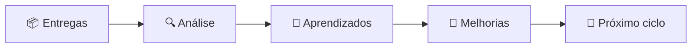

# 🔄 Retrospectiva da Equipe

> Este template deve ser preenchido ao final de uma etapa importante ou ao término do Ideathon. A retrospectiva ajuda a equipe a reconhecer avanços, identificar dificuldades e planejar melhorias para os próximos ciclos.

---

## 🧾 Identificação

- **Nome do projeto:** 
- **Nome da equipe:** 
- **Etapa ou ciclo avaliado:** 
- **Data:** 
- **Participantes:** 
- **Responsável pelo registro:** 

---

## 🎯 Objetivo do ciclo

Qual era o principal objetivo desta etapa ou período de trabalho?

> 

---

## 📦 Entregáveis previstos

| Entregável | Situação | Evidência ou link |
|---|---|---|
|  | ⬜ Não iniciado / 🟡 Parcial / 🟢 Concluído |  |
|  | ⬜ Não iniciado / 🟡 Parcial / 🟢 Concluído |  |
|  | ⬜ Não iniciado / 🟡 Parcial / 🟢 Concluído |  |

---

## ✅ O que funcionou bem?

Registre práticas, decisões e comportamentos que contribuíram para o avanço da equipe.

- 🌟 
- 🌟 
- 🌟 

### Evidências

- commits, issues ou documentos relevantes;
- testes concluídos;
- feedback recebido;
- decisões que reduziram riscos ou retrabalho.

> 

---

## ⚠️ O que não funcionou como esperado?

Registre dificuldades sem atribuir culpa individual. O foco deve estar no processo, na comunicação e nas condições de trabalho.

- 🔸 
- 🔸 
- 🔸 

### Possíveis causas

- [ ] Escopo excessivo
- [ ] Falta de clareza nas tarefas
- [ ] Problemas de comunicação
- [ ] Dificuldades técnicas
- [ ] Dependência entre tarefas
- [ ] Falta de tempo
- [ ] Infraestrutura ou conectividade
- [ ] Ausência de validação com usuários
- [ ] Uso inadequado ou excessivo de IA
- [ ] Outro: 

---

## 🧠 O que aprendemos?

### Aprendizados técnicos

> 

### Aprendizados sobre o problema e os usuários

> 

### Aprendizados sobre colaboração

> 

### Aprendizados sobre planejamento e organização

> 

### Aprendizados sobre uso de IA e outras tecnologias

> 

---

## 🔧 O que deve ser melhorado?

| Melhoria necessária | Ação concreta | Responsável | Prazo |
|---|---|---|---|
|  |  |  |  |
|  |  |  |  |
|  |  |  |  |

---

## 🚀 O que faremos no próximo ciclo?

### Prioridade 1

- **Ação:** 
- **Resultado esperado:** 
- **Responsável:** 
- **Prazo:** 

### Prioridade 2

- **Ação:** 
- **Resultado esperado:** 
- **Responsável:** 
- **Prazo:** 

### Prioridade 3

- **Ação:** 
- **Resultado esperado:** 
- **Responsável:** 
- **Prazo:** 

---

## 🛑 O que devemos parar, continuar e começar?

| Parar de fazer 🛑 | Continuar fazendo ✅ | Começar a fazer 🚀 |
|---|---|---|
|  |  |  |
|  |  |  |
|  |  |  |

---

## 🤝 Colaboração e participação

### Como a equipe distribuiu o trabalho?

> 

### Houve equilíbrio de participação?

- [ ] Sim
- [ ] Parcialmente
- [ ] Não

**Justificativa:**

> 

### Como os conflitos ou divergências foram tratados?

> 

### Que apoio foi necessário?

> 

---

## 🤖 Avaliação do uso de Inteligência Artificial

- **Ferramentas utilizadas:** 
- **Finalidades:** 
- **O conteúdo foi validado pela equipe?** 
- **Houve erros ou respostas inadequadas?** 
- **A equipe compreende o que foi incorporado ao projeto?** 
- **Registro detalhado:** [consultar o registro de uso de IA](registro-de-uso-de-ia.md)

---

## 📊 Autoavaliação da equipe

Avalie cada dimensão de 1 a 4.

| Dimensão | 1 | 2 | 3 | 4 | Nota da equipe |
|---|---:|---:|---:|---:|---:|
| Clareza do problema | Insuficiente | Parcial | Adequada | Consistente |  |
| Organização das tarefas | Insuficiente | Parcial | Adequada | Consistente |  |
| Colaboração | Insuficiente | Parcial | Adequada | Consistente |  |
| Qualidade técnica | Insuficiente | Parcial | Adequada | Consistente |  |
| Testes e validação | Insuficiente | Parcial | Adequada | Consistente |  |
| Documentação | Insuficiente | Parcial | Adequada | Consistente |  |
| Comunicação | Insuficiente | Parcial | Adequada | Consistente |  |
| Uso ético das tecnologias | Insuficiente | Parcial | Adequada | Consistente |  |

---

## 💬 Feedback entre integrantes

Cada integrante pode registrar uma contribuição positiva observada na equipe e uma sugestão de melhoria.

| Integrante | Contribuição reconhecida | Sugestão construtiva |
|---|---|---|
|  |  |  |
|  |  |  |
|  |  |  |
|  |  |  |

---

## 🏁 Síntese final

### Maior conquista da equipe

> 

### Principal dificuldade

> 

### Decisão mais importante

> 

### Próximo passo essencial

> 

---

## ✍️ Compromisso para o próximo ciclo

> Como equipe, comprometemo-nos a aplicar os aprendizados desta retrospectiva, acompanhar as ações definidas e manter registros transparentes sobre decisões, responsabilidades e resultados.

- **Integrantes:** 
- **Data:** 

---

> 💡 **Regra da retrospectiva:** analisar o processo para melhorar o próximo ciclo, sem transformar dificuldades em acusações pessoais.